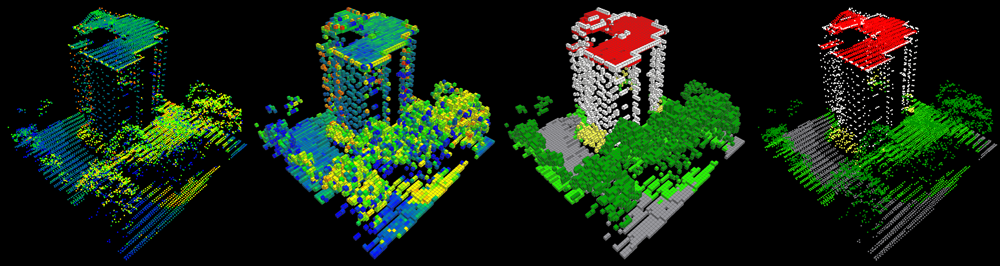

# Flare

This repo includes code for **semantic segmentation of ALS point clouds and tree detection**, used in   
- [Submanifold Sparse Convolutional Networks for Semantic Segmentation of Large-Scale ALS Point Clouds](https://doi.org/10.5194/isprs-annals-IV-2-W5-77-2019)  
- [The Hessigheim 3D (H3D) benchmark on semantic segmentation of high-resolution 3D point clouds and textured meshes from {UAV LiDAR} and Multi-View-Stereo](https://doi.org/10.1016/j.ophoto.2021.100001)  
- [Individual Tree Detection in Urban ALS Point Clouds with 3D Convolutional Networks](https://doi.org/10.3390/rs14061317).

This is basically a wrapper for [**Submanifold Sparse Convolutional Networks**](https://github.com/facebookresearch/SparseConvNet).
It also includes a wrapper for laspy and a toolbox for fancy confusion matrix 
generation and plotting.





## Installation:

**Tested on:**

- python 3.7
- PyTorch 1.3.0
- Laspy 1.6.0  (!)
- CUDA 11.2
- Anaconda 4.8.2
- Titan RTX
- Kubuntu 19.10
- [SparseConvNet commit d27491d](https://github.com/facebookresearch/SparseConvNet/tree/d27491d438ea871b2025c51a9a779f268fbe84da)
  

### Install Conda packages:
Create new conda env using:  
```$ conda env create --name <env_name> --file env_export_flare.yml```   
or install packages into existing env:   
```$ conda install --name <env> --file env_export_flare.yml```

#### Post-Installation-Instructions for cython (on Windows only):
After installing cython (pip, conda, whatever), you need to install the Visual
Studio C/C++ compiler. See https://wiki.python.org/moin/WindowsCompilers for 
the required compiler version (>python 3.5 => visual studio 19 = compiler 
14.X).  
**Tipp:** to save disk space, install only the *build tools*, not the full IDE.  


### Install Pytorch
From pytorch.org, select your preferences and run the conda install command. E.g.  
`$ conda install pytorch==1.3.0 torchvision cudatoolkit=11.2 -c pytorch`


### Install Sparse CNN Framework
Try to follow the instructions from [SparseConvNet on github](https://github.com/facebookresearch/SparseConvNet)
or do the following (recomended):

1. From within your conda env:  
	`$ sudo apt install unrar`  
	`$ conda install google-sparsehash -c bioconda   # OR apt install libsparsehash-dev`  
	`$ cd ~`  
	`$ git clone https://github.com/facebookresearch/SparseConvNet`  
	`$ git checkout d27491d438ea871b2025c51a9a779f268fbe84da`  
	`$ cd \SparseConvNet`  
	`$ git checkout d27491d438ea871b2025c51a9a779f268fbe84da`
	`$ bash develop.sh`  
2. Test example:  
	`$ cd examples/Assamese_handwriting`  
	`$ python VGGplus.py`  
	This should converge to an top5 train error of 0.0% in about 4 Epochs, 30-40s each.


### Install Flare
1. Clone or copy this repo into desired location.
2. Add repo folder to your search path. In anaconda, type from within your env:  
    ```$ conda develop <path_to_repo>```  
3. Run this package's unittests to ensure it works correctly (may not cover everything, though). From the packages 
`./tests/` directory, run:  
`$ python -m unittest`


## Getting Started
This repo includes the `flare` python package and also `./examples/` projects demonstrating the usage of this package.
```
	project/
	├── configs/  
	├── data/  
	│   ├── raw/  
	│   ├── sampled/  
	│   └── voxelized/  
	├── models/  
	├── predictions/  
	│  
	├── globals.py  
	└── import_sample_train_test.py
```

The general workflow is composed of 4 steps. See the demo scrips in the example folder.

1. **Import / Voxelization**
2. **Sampling**
3. **Training**
4. **Inference / Test**

By importing, all point clouds in the specified `/data/raw` folder are rotation augmented, voxelized,
and saved as point cloud / voxel cloud pairs (you can exclude the point clouds for the training and validation set to 
save space when working with large data). Additionally, a pickle-file is stored, which containes a index list to map 
from points to their voxels (for inference label mapping).  
Then, the imported point / voxel cloud pairs are sampled through horizontal tiling.  
Training is controlled by four `.json` config files: training data, validation data, model, & training procedure, while
testing only requires the model name and the testing data config.  
Testing can be done on sampled or unsampled data (the latter is slighty more accurate; see demos on how to.)


### Preparations:
Demo projects are provided for 2+1 benchmark datasets. You can download the data from:
- [**V3D:** https://www.isprs.org/education/benchmarks/UrbanSemLab/default.aspx](https://www.isprs.org/education/benchmarks/UrbanSemLab/default.aspx)
- [**H3D:** https://ifpwww.ifp.uni-stuttgart.de/benchmark/hessigheim/default.aspx](https://ifpwww.ifp.uni-stuttgart.de/benchmark/hessigheim/default.aspx)

Copy the data files into the respective `./data/` directories. 

For H3D Mesh training and validation sets, you first have to calculate the center of gravity (CoG) quasi-point clouds 
(optimally with RGB features).

Checkpoints are also provided. (Note: only small models, best accuracies were achieved with bigger models; all configs 
are the demo projects).  


### Running Demo Scripts:

For **V3D**, run `prepare_V3D_data.py`, followed by `demo_V3D.py`.  
For **H3D**, run `prepare_H3D_data.py`, followed by `demo_H3D.py`.  
For **H3D_Mesh**, run `demo_H3D_Mesh__inference_on_Benchi-TestCoGs.py`.


### Using your own data:
If you want to use your own data, just copy and edit one of the example project folders.  

Supported data input formats are:

- `.PTS`:
	- White-space seperated.
    - Each column must contain its name in the header line!
- `.LAS`:
    - Version 1.2 or lower.
    - .laz may work with LasZip (https://github.com/LASzip) installed, but no guarantee.
    - See laspy docu for details, for example how standard-fields are named.

**IMPORTANT:** 
- Points must have at least x, y and z coordinates! (+ other scalar fields that
  can be used as features. May also require some "ground truth" field)
- After import, all field names are lower-case!
- Max range of labels is 0..65535!
- Max number of points per voxel is 65535!


## Citations

If you find this code useful in your research then please cite: 
```
@InProceedings{SchmohlSoergel2019a,
  author     = {Schmohl, Stefan and Soergel, Uwe},
  title      = {Submanifold Sparse Convolutional Networks for Semantic Segmentation of Large-Scale {ALS} Point Clouds},
  booktitle  = {ISPRS Annals of Photogrammetry, Remote Sensing and Spatial Information Sciences},
  year       = {2019},
  volume     = {IV-2/W5},
  pages      = {77--84},
  month      = jun,
  doi        = {10.5194/isprs-annals-IV-2-W5-77-2019},
}
```

and
```
@article{3DSemanticSegmentationWithSubmanifoldSparseConvNet,
  title={3D Semantic Segmentation with Submanifold Sparse Convolutional Networks},
  author={Graham, Benjamin and Engelcke, Martin and van der Maaten, Laurens},
  journal={CVPR},
  year={2018}
}
```
